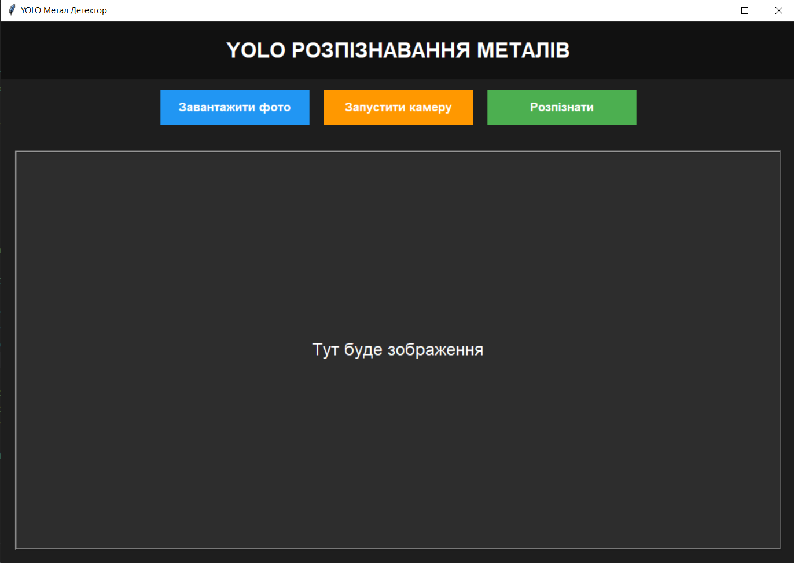
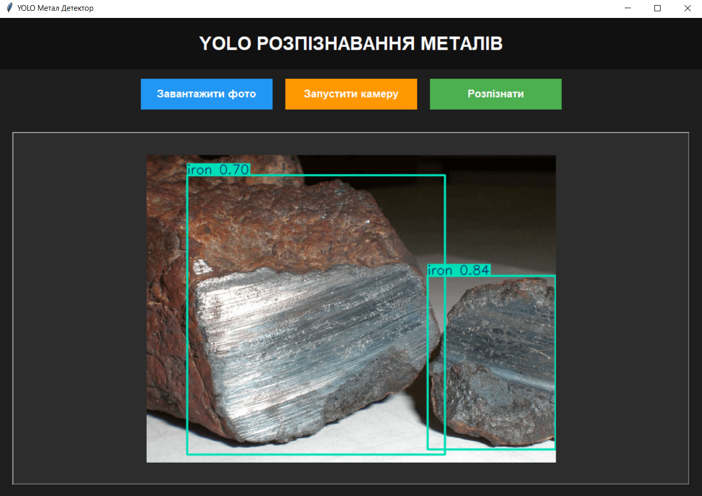

# YOLO Metal Detector

Система розпізнавання металів у реальному часі на основі YOLO та Python.

---

## Можливості

* Завантаження фото
* Робота з вебкамерою
* Детекція металів у реальному часі
* Відображення результатів розпізнавання
* Сучасний GUI інтерфейс на Tkinter

---

# Інтерфейс програми

<p align="center">
  
</p>

---

# Використані технології

* Python 3.10+
* Tkinter
* OpenCV
* Ultralytics YOLO
* Pillow

---

# Структура проєкту

```text
project/
│
├── main.py
├── best.pt
├── README.md
└── images/
    └── interface.png
```

---

# Встановлення та запуск

## 1. Клонування репозиторію

```bash
git clone https://github.com/realmaxtimko/YOLO-Metal-Detector.git                           )
```

```bash
cd YOLO-Metal-Detector
```

---

# 2. Створення віртуального середовища

## Windows

```bash
python -m venv venv
```

---

# 3. Активація середовища

## PowerShell

```bash
.\venv\Scripts\activate
```

---

# 4. Встановлення залежностей

```bash
pip install ultralytics
pip install opencv-python
pip install pillow
```

---

# 5. Запуск програми

```bash
python main.py
```

---

# Використання

## Завантаження фото

1. Натиснути кнопку:

```text
Завантажити фото
```

2. Вибрати зображення

3. Натиснути:

```text
Розпізнати
```

4. Отримати результат детекції

---

# Робота з камерою

1. Натиснути:

```text
Запустити камеру
```

2. Програма почне розпізнавання у реальному часі

3. Для зупинки натиснути:

```text
Зупинити камеру
```

---

# Можливі помилки

## Не знайдено модель

```text
No such file or directory: best.pt
```

### Рішення

Переконайтесь, що файл:

```text
best.pt
```

знаходиться в одній папці з:

```text
main.py
```

---

# Не працює камера

Перевірте:

* чи підключена камера
* чи камера не використовується іншими програмами
* чи є доступ до камери у Windows

---

# Приклад роботи

<p align="center">
  
</p>

---

# Автор

Максим Тимко

Львівський національний університет імені Івана Франка
